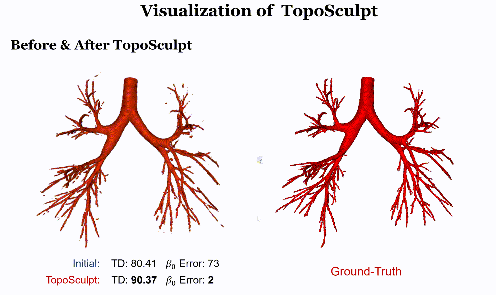
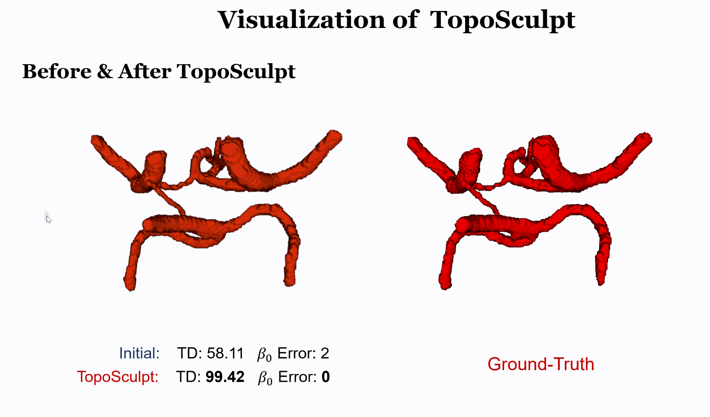

# TopoSculpt
[**_TopoSculpt: Betti-Steered Topological Sculpting of Three-Dimensional Tubular Shapes_**](https://arxiv.org/pdf/2509.03938)

> By Minghui Zhang, Yaoyu Liu, Junyang Wu, Xin You, Hanxiao Zhang, Junjun He, Yun Gu, Xinglin Zhang
>> Institute of Medical Robotics, Shanghai Jiao Tong University, Shanghai, China

>> Shanghai AI Lab, Shanghai, China.

## Introduction
Medical tubular anatomical structures are inherently three-dimensional conduits with lumens, enclosing walls, and complex branching topologies. Accurate reconstruction of their geometry and topology is crucial for applications such as bronchoscopic navigation and cerebral arterial connectivity assessment. Existing methods often rely on voxel-wise overlap measures, which fail to capture topological correctness and completeness. Although topology-aware losses and persistent homology constraints have shown promise, they are usually applied patch-wise and cannot guarantee global preservation or correct geometric errors at inference.
To address these limitations, we propose a novel TopoSculpt, a framework for topological refinement of 3D fine-grained tubular structures. TopoSculpt (i) adopts a holistic whole-region modeling strategy to capture full spatial context, (ii) first introduces a Topological Integrity Betti (TIB) constraint that jointly enforces Betti number priors and global integrity, and (iii) employs a curriculum refinement scheme with persistent homology to progressively correct errors from coarse to fine scales.
Extensive experiments on three challenging tubular datasets, including the pulmonary airway, the Circle of Willis (CoW), and the coronary artery (CTCA), demonstrate substantial improvements in both geometric accuracy and topological fidelity. For instance, the $\beta_{0}$ error is reduced from 69.00 to 3.40 on the airway dataset, from 1.65 to 0.30 on the CoW dataset, and from 8.75 to 0.88 on the CTCA dataset, with Tree Detection (TD) and Branch Detection (BD) rates improving by approximately 10\%. These results highlight the effectiveness of TopoSculpt in correcting critical topological errors and advancing high-fidelity modeling of complex 3D tubular anatomy.


## Usage
The class of TopoSculpt is provided in ```toposculpt.py```. 

The core implementation of the Topology Integrity Betti is provided in ```TIB.py```.


## Visualization of TopoSculpt on Airway Data
#### Case 1

#### Case 2


## Visualization of TopoSculpt on Circle of Willis (CoW) Data
#### Case 1

#### Case 2



## Visualization of TopoSculpt on computed tomography coronary angiography (CTCA) Data
#### Case 1

#### Case 2


## Visualization of TopoSculpt Process:
#### Airway Case

#### TopCoW Case


## 📝 Citation
If you find this repository or our paper useful, please consider citing our paper:
```bibTex
@article{zhang2025toposculpt,
  title={TopoSculpt: Betti-Steered Topological Sculpting of 3D Fine-grained Tubular Shapes},
  author={Zhang, Minghui and Liu, Yaoyu and Wu, Junyang and You, Xin and Zhang, Hanxiao and He, Junjun and Gu, Yun},
  journal={arXiv preprint arXiv:2509.03938},
  year={2025}
}
```