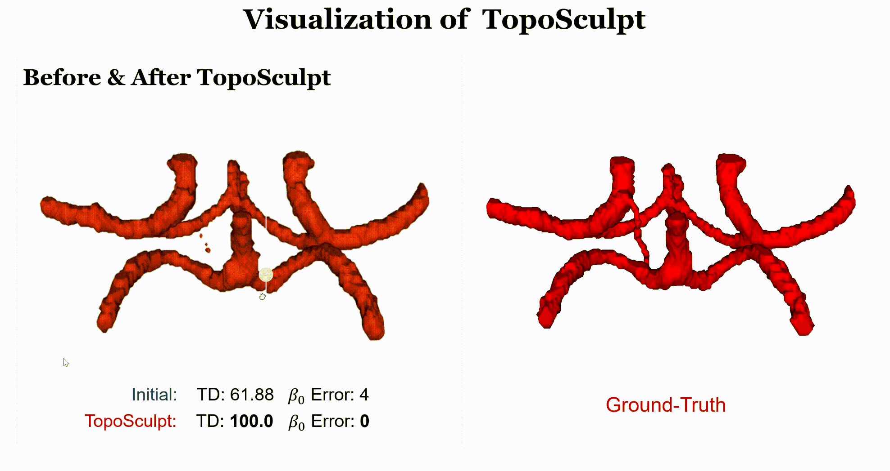

# TopoSculpt
[**_TopoSculpt: Betti-Steered Topological Sculpting of 3D Fine-grained Tubular Shapes_**](https://arxiv.org/pdf/2509.03938)

> By Minghui Zhang, Yaoyu Liu, Junyang Wu, Xin You, Hanxiao Zhang, Junjun He, Yun Gu
>> Institute of Medical Robotics, Shanghai Jiao Tong University, Shanghai, China

>> Shanghai AI Lab, Shanghai, China.

## Visualization of TopoSculpt on Airway Data
#### Case 1

#### Case 2


## Visualization of TopoSculpt on Circle of Willis (CoW) Data\
#### Case 1

#### Case 2


## 📝 Citation
If you find this repository or our paper useful, please consider citing our paper:
```bibTex
@article{zhang2025toposculpt,
  title={TopoSculpt: Betti-Steered Topological Sculpting of 3D Fine-grained Tubular Shapes},
  author={Zhang, Minghui and Liu, Yaoyu and Wu, Junyang and You, Xin and Zhang, Hanxiao and He, Junjun and Gu, Yun},
  journal={arXiv preprint arXiv:2509.03938},
  year={2025}
}
```